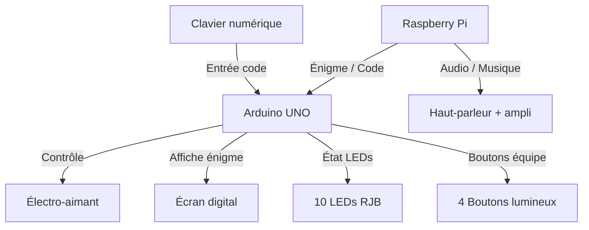

# Box Capture de Zone – LaseRed Yverdon

##  Cahier des charges

- **But du projet** : Coffre électronique avec digicode, boutons lumineux, LEDs RJB, son, et verrouillage par électro-aimant.
    


- **Contraintes** :
    
    - Matériel robuste (usage intensif).
        
    - Maintenance simple.
        
    - Audio de bonne qualité.
        
    - Mise à jour facile des énigmes et sons gérées à distance. 
        
    - Intégration dans un coffre résistant.
        

---

[[Order BoxCapture LaseRed]]
[[Electronic  Architecture]]

****
##  Architecture générale

### Schéma fonctionnel



---

## Composants

### 🔹 1. Unité de contrôle

- **Arduino UNO**
    
    ![[ArduinoUNO.png|300]]
        
    - [Lien fournisseur](https://www.galaxus.ch/fr/s1/product/arduino-uno-rev3-carte-de-developpement-kit-5764177)
        
    - Dimensions : …
        
    - Notes : choisi pour son nombre d’entrées/sorties.
        
- **Raspberry Pi (3B+/4)**
    
    - ![[RaspberryPI4.png|300]]
    - 
        
    - [Lien fournisseur](https://www.galaxus.ch/fr/s1/product/raspberry-pi-3-model-b-carte-de-developpement-kit-8024081)
        
    - Dimensions : …
        
    - Notes : gère l’audio et la lecture des énigmes.
        

---

### 🔹 2. Interface utilisateur

- **Clavier numérique métallique (digicode)**
    
    ![[digicode.png|300]]
        
    - [Lien fournisseur](https://de.aliexpress.com/item/1005002655939418.html?spm=a2g0o.productlist.main.35.5d13EL6LEL6Lwh&algo_pvid=87904cf4-b5d1-4f38-9029-ddac9dd806e1&algo_exp_id=87904cf4-b5d1-4f38-9029-ddac9dd806e1-34&pdp_ext_f=%7B%22order%22%3A%2215%22%2C%22eval%22%3A%221%22%2C%22fromPage%22%3A%22search%22%7D&pdp_npi=6%40dis%21CHF%2126.58%2123.39%21%21%2132.87%2128.93%21%40211b6c1917583837776378199e2cd6%2112000021579303864%21sea%21CH%210%21ABX%211%210%21n_tag%3A-29910%3Bd%3A55710381%3Bm03_new_user%3A-29895&curPageLogUid=ZNT4Crmdeele&utparam-url=scene%3Asearch%7Cquery_from%3A%7Cx_object_id%3A1005002655939418%7C_p_origin_prod%3A)
        
    - Dimensions : …
        
    - Notes : Le keypad, ou digicode, est une matrice de bouton dont l’état (0 ou 1) peut être détecté par un microcontroleur. Le keypad est sous forme de matrice, c’est à dire que tous les boutons d’une colonne sont reliés une entrée et tous les boutons d’une même ligne sont reliés à une 2ème entrée. Lorsqu’on appuie sur un bouton il ferme le circuit en reliant l’entrée correspondant à la ligne à l’entrée correspondant à la colonne. L’avantage de ce type de montage est que l’on peut gérer 16 boutons avec seulement 8 entrées du microcontrôleur.
        
- **Écran digital (LCD ou OLED)**
    
    - ![[LcdScreen.png|400]]
        
    - [Lien fournisseur](https://de.aliexpress.com/item/1005006086057327.html?spm=a2g0o.productlist.main.10.401b32edILdJnx&algo_pvid=b8fede2a-9f5e-4950-b4ad-44aef260ee7e&algo_exp_id=b8fede2a-9f5e-4950-b4ad-44aef260ee7e-9&pdp_ext_f=%7B%22order%22%3A%22216%22%2C%22eval%22%3A%221%22%2C%22fromPage%22%3A%22search%22%7D&pdp_npi=6%40dis%21CHF%210.61%210.55%21%21%210.76%210.68%21%402103963717583849026685819ec7bc%2112000035663693815%21sea%21CH%210%21ABX%211%210%21n_tag%3A-29910%3Bd%3A55710381%3Bm03_new_user%3A-29895&curPageLogUid=XIGP0ifBlH6G&utparam-url=scene%3Asearch%7Cquery_from%3A%7Cx_object_id%3A1005006086057327%7C_p_origin_prod%3A)
        
    - Dimensions : …
        
    - Notes : affichage des énigmes/clues.
        
- **Boutons lumineux métalliques (R, B, J, V)**
    
    - ![[BoutonRetroeclairer.png|300]]
        
    - [Interrupteurs](https://de.aliexpress.com/item/1005009072059590.html?spm=a2g0o.detail.pcDetailTopMoreOtherSeller.19.1d387a57TPpX9A&gps-id=pcDetailTopMoreOtherSeller&scm=1007.40050.354490.0&scm_id=1007.40050.354490.0&scm-url=1007.40050.354490.0&pvid=490a8028-b0ac-4c3f-a999-92feb4d62b06&_t=gps-id:pcDetailTopMoreOtherSeller,scm-url:1007.40050.354490.0,pvid:490a8028-b0ac-4c3f-a999-92feb4d62b06,tpp_buckets:668%232846%238107%231934&pdp_ext_f=%7B%22order%22%3A%2217%22%2C%22eval%22%3A%221%22%2C%22sceneId%22%3A%2230050%22%7D&pdp_npi=6%40dis%21CHF%211.93%211.93%21%21%212.38%212.38%21%40211b813b17576680315782780e8a18%2112000047815888981%21rec%21CH%21%21ABX%211%210%21n_tag%3A-29910%3Bd%3A55710381%3Bm03_new_user%3A-29895&utparam-url=scene%3ApcDetailTopMoreOtherSeller%7Cquery_from%3A%7Cx_object_id%3A1005009072059590%7C_p_origin_prod%3A)
        
    - Dimensions : …
        
    - Notes : rétroéclairés, usage intensif.
        
- **LEDs RJB (10 unités)**
    
    - [Image ici]
        
    - [Lien fournisseur]
        
    - Dimensions : …
        
    - Notes : utilisées pour compte à rebours et affichage.
        

---

### 🔹 3. Système de verrouillage

- **Électro-aimant 12 V NC (Normally Closed)**
    
    - [Image ici]
        
    - [Lien fournisseur]
        
    - Dimensions : …
        
    - Notes : coffre verrouillé par défaut, robuste, prévu pour usage intensif.
        

    
---

### 🔹 4. Audio

- **Module ampli classe D (ex : PAM8403, 5–10 W)**
    
    - [Image ici]
        
    - [Lien fournisseur]
        
    - Dimensions : …
        
    - Notes : compact, efficace.
        
- **Haut-parleur 8 Ω / 5–10 W**
    
    - [Image ici]
        
    - [Lien fournisseur]
        
    - Dimensions : …
        
    - Notes : bonne qualité sonore, musique + sons.
        

---

### 🔹 5. Alimentation

- **Alim principale 12 V DC (5 A)**
    
    - [Image ici]
        
    - [Lien fournisseur]
        
    - Notes : alimente électro-aimant et via convertisseur le reste.
        
- **Convertisseur DC-DC (12 V → 5 V 3 A)**
    
    - [Image ici]
        
    - [Lien fournisseur]
        
    - Notes : pour Raspberry Pi et Arduino.
        

---

## Logiciel


####  Côté Arduino (coffre)

- `main.ino` → boucle principale, gère clavier, écran, électroaimant.
    
- `buttons.ino` → gestion des boutons couleur.
    
- `lock.ino` → gestion de l’électroaimant et du verrou.
    
- `leds_internal.ino` → LEDs internes (10 petites diodes).
    
- `comm.ino` → communication série avec le Raspberry.
    

#### Côté Raspberry (gestion centrale et audio)

- `main.py` → boucle principale, reçoit les messages des coffres.
    
- `leds_rgb.py` → contrôle des bandeaux LED de la zone/salle.
    
- `audio.py` → joue la musique de fond + effets sonores.
    
- `scores.py` → calcule les temps de capture et gère l’affichage sur les LEDs du boîtier central.

Côté Arduino 
```
setup:
    initialiser écran LCD
    initialiser clavier
    initialiser électroaimant
    initialiser boutons couleurs
    initialiser LEDs internes
    initialiser communication avec Raspberry

loop:
    afficher énigme sur l’écran
    attendre saisie code clavier
    si code correct:
        déverrouiller électroaimant
        attendre qu’un bouton couleur soit pressé
        si bouton couleur pressé:
            envoyer "couleur capturée" au Raspberry
            lancer décompte de 20s avec LEDs internes
            si décompte fini sans contestation:
                verrouiller électroaimant
                demander une nouvelle énigme au Raspberry
    si combinaison spéciale (4 boutons enfoncés 5s):
        envoyer "reset" au Raspberry
```

Côté Raspberry : 

```
setup:
    initialiser communication avec Arduino
    charger musiques + effets sonores
    initialiser LEDs extérieures (boîtier central)
    initialiser bouton reset

loop:
    attendre messages des coffres
    si "couleur capturée":
        jouer effet sonore "capture"
        mettre LEDs extérieures à la couleur correspondante
        démarrer timer de capture
    si "reset":
        réinitialiser scores
        jouer effet sonore "reset"
        mettre LEDs extérieures en blanc
    gérer calcul des scores en continu:
        temps capturé par chaque équipe
        affichage % sur LEDs extérieures
    musique de fond tourne en boucle (modifiable facilement)

```
