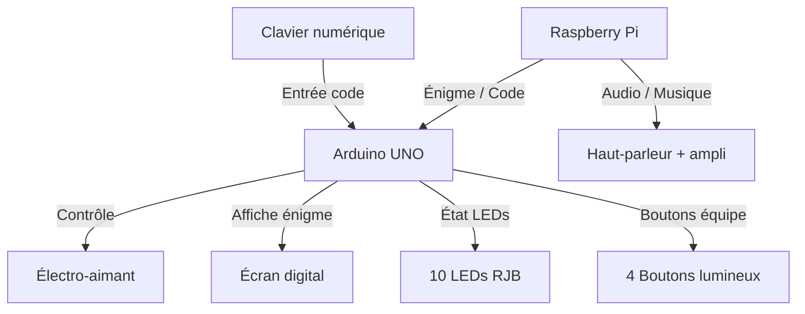

# Box Capture de Zone – LaseRed Yverdon

##  Cahier des charges

- **But du projet** : Coffre électronique avec digicode, boutons lumineux, LEDs RJB, son, et verrouillage par électro-aimant.
    


- **Contraintes** :
    
    - Matériel robuste (usage intensif).
        
    - Maintenance simple.
        
    - Audio de bonne qualité.
        
    - Mise à jour facile des énigmes et sons gérées à distance. 
        
    - Intégration dans un coffre résistant.
        

---


****
##  Architecture générale

### Schéma fonctionnel




```
