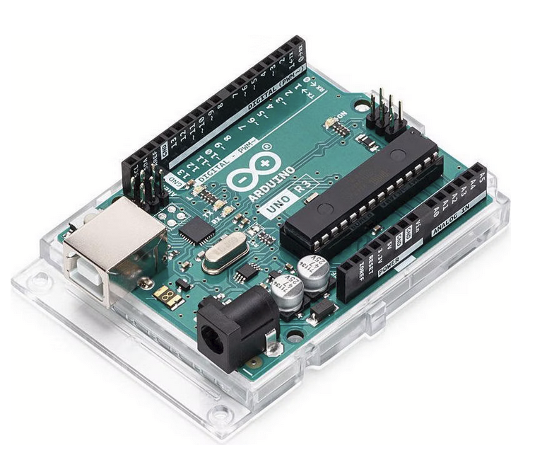
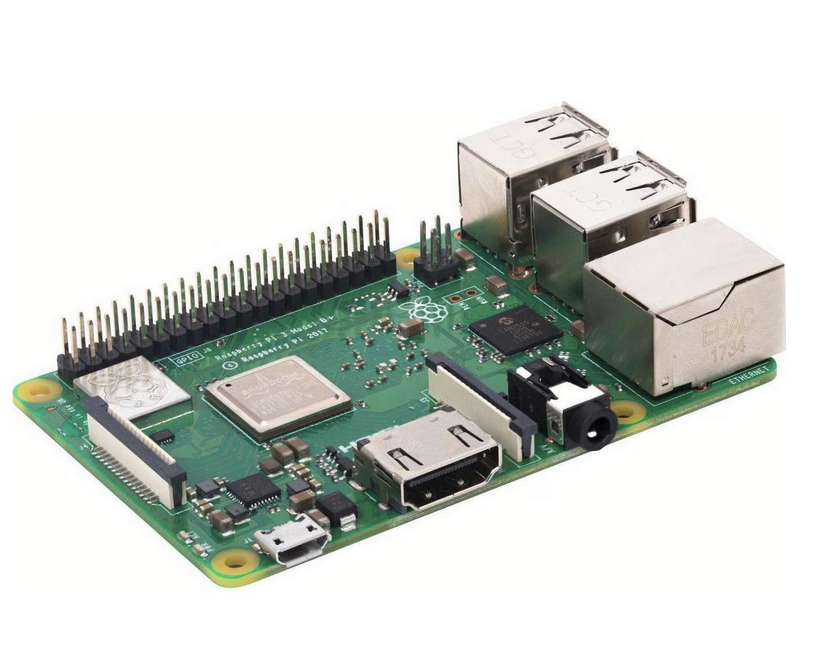
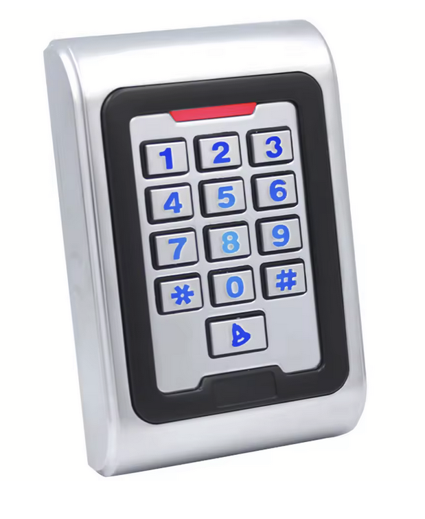
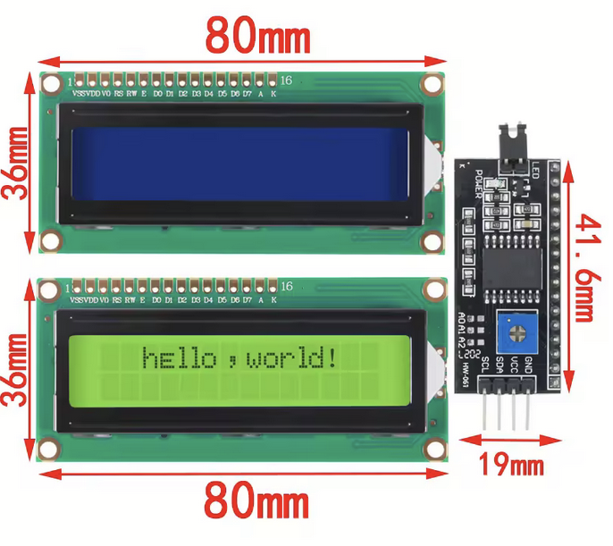
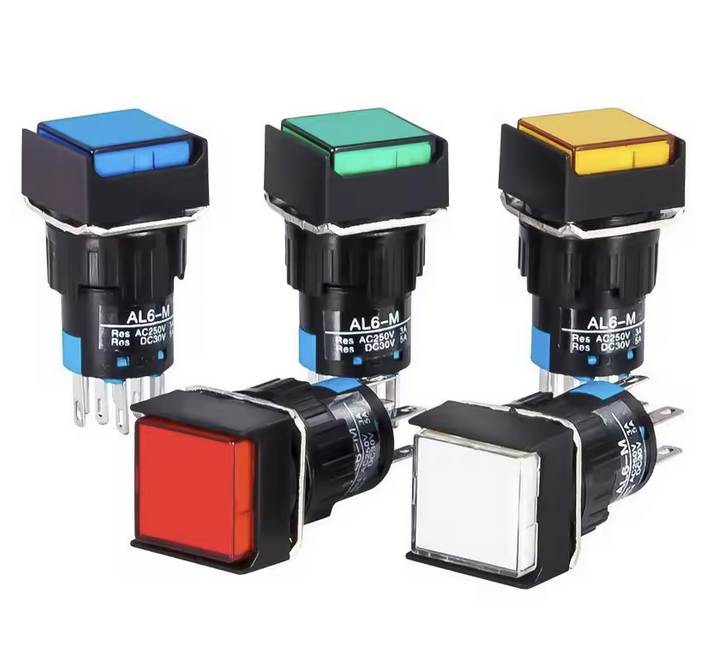

## List of components

### 🔹 1. Unité de contrôle

- **Arduino UNO**

  

  - [Lien fournisseur](https://www.galaxus.ch/fr/s1/product/arduino-uno-rev3-carte-de-developpement-kit-5764177)
  - Dimensions : …
  - Notes : choisi pour son nombre d’entrées/sorties.
        
- **Raspberry Pi (3B+/4)**

  

  - [Lien fournisseur](https://www.galaxus.ch/fr/s1/product/raspberry-pi-3-model-b-carte-de-developpement-kit-8024081)
  - Dimensions : …
  - Notes : gère l’audio et la lecture des énigmes.

---

### 🔹 2. Interface utilisateur

- **Clavier numérique métallique (digicode)**

  

  - [Lien fournisseur](https://de.aliexpress.com/item/1005002655939418.html)
  - Dimensions : …
  - Notes : Le keypad, ou digicode, est une matrice de boutons dont l’état (0 ou 1) peut être détecté par un microcontrôleur. Lorsqu’on appuie sur un bouton, il ferme le circuit reliant la ligne et la colonne correspondantes. Ce type de montage permet de gérer 16 boutons avec seulement 8 entrées.

- **Écran digital (LCD ou OLED)**

  

  - [Lien fournisseur](https://de.aliexpress.com/item/1005006086057327.html)
  - Dimensions : …
  - Notes : affichage des énigmes / clues.

- **Boutons lumineux métalliques (R, B, J, V)**

  

  - [Lien fournisseur](https://de.aliexpress.com/item/1005009072059590.html)
  - Dimensions : …
  - Notes : rétroéclairés, usage intensif.

- **LEDs RGB (10 unités)**

  

  - [Lien fournisseur](https://de.aliexpress.com/)
  - Dimensions : …
  - Notes : utilisées pour compte à rebours et affichage.

---

### 🔹 3. Système de verrouillage

- **Électro-aimant 12 V NC (Normally Closed)**

  

  - [Lien fournisseur](https://de.aliexpress.com/)
  - Dimensions : …
  - Notes : coffre verrouillé par défaut, robuste, prévu pour usage intensif.

---

### 🔹 4. Audio

- **Module ampli classe D (ex : PAM8403, 5–10 W)**

  

  - [Lien fournisseur](https://de.aliexpress.com/)
  - Dimensions : …
  - Notes : compact, efficace.

- **Haut-parleur 8 Ω / 5–10 W**

  

  - [Lien fournisseur](https://de.aliexpress.com/)
  - Dimensions : …
  - Notes : bonne qualité sonore, musique + sons.

---

### 🔹 5. Alimentation

- **Alim principale 12 V DC (5 A)**

  

  - [Lien fournisseur](https://de.aliexpress.com/)
  - Notes : alimente électro-aimant et, via convertisseur, le reste.

- **Convertisseur DC-DC (12 V → 5 V 3 A)**

  

  - [Lien fournisseur](https://de.aliexpress.com/)
  - Notes : pour Raspberry Pi et Arduino.
